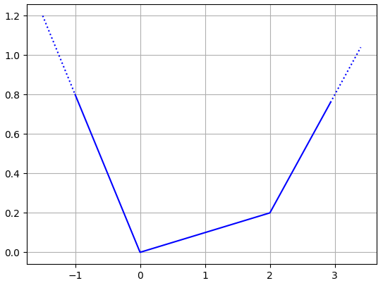
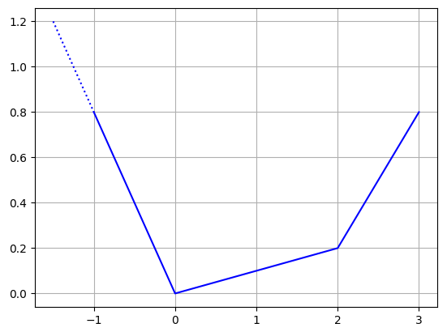
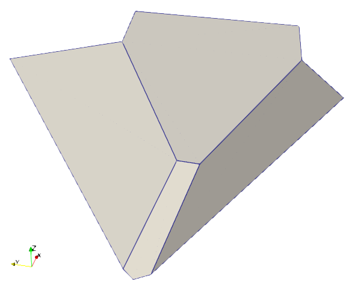
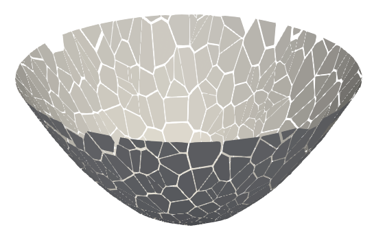

# Python bindings for PolyCon

## Installation

`pip install polycon` should work on the most common platforms.

It includes the precompiled dynamic libraries for the most common cases (e.g. double precision, dimensionality < 10, ...). If your cases are not in the precompiled binary distribution, you will only have to install `cppimport` (`pip install cppimport`) and a C++ compiler (g++ or msvc for instance), the rest will be automatic.

## Construction

`PolyCon` is the name of the main class used to store and handle the polyhedral convex functions.

The main constructor take 4 numpy compatible arrays as input parameters:
* `a_dirs`: a 2D array where `a_dirs[ n, : ]` represents the gradient of `n`th affine function
* `a_offs`: a 1D array where `a_dirs[ n ]` represents the offset of `n`th affine function
* `b_dirs`: a 2D array where `b_dirs[ m, : ]` represents the direction of `m`th boundary (points to the exterior)
* `b_offs`: a 1D array where `b_dirs[ m ]` represents the offset of `m`th boundary (the scalar product of a point on the boundary with the corresponding direction must be equal to this offset).

For instance

```python
from polycon import PolyCon

# affine functions
a_dirs = [ [ -0.8 ], [ +0.1 ], [ +0.6 ] ]
a_offs = [ 0, 0, 1 ]

# boundaries (none for now)
b_dirs = []
b_offs = []

# plot
pd = PolyCon( a_dirs, a_offs, b_dirs, b_offs )
pd.plot()
```

gives something like:



The dots in the matplotlib represent infinite edge, meaning that the function is not bounded in this direction.

In the following example, we add a boundary:

```python
from polycon import PolyCon

# affine functions
a_dirs = [ [ -0.8 ], [ +0.1 ], [ +0.6 ] ]
a_offs = [ 0, 0, 1 ]

# boundaries (we cut x > 2 points)
b_dirs = [ [ 1 ] ]
b_offs = [ 2 ]

# plot
pd = PolyCon( a_dirs, a_offs, b_dirs, b_offs )
pd.plot()
```

It gives something like:



## Displaying

The `plot` function uses matplotlib for simple and immediate representations. Here are the most common parameters
* `show` (`True` by default) to launch matplotlib.pyplot.show() at the end of the procedure
* `color` (`black` by default) to give the color of the curve

Alternatively, for more elaborate renderings, one can use `write_vtk` which generates `.vtk` files that can be used by Paraview of Mayavi for instance. Here is an example:

```python
from polycon import PolyCon
import numpy as np

# a 2D bounded polyhedral convex function
a_dirs = [ [ 0, 0 ], [ 1, 0 ], [ 0, -1 ], [ 0, +1 ] ]
a_offs = [ -0.1, 0, 0, 0 ]

b_dirs = [ [ np.cos( a ), np.sin( a ) ] for a in np.linspace( 0, 2 * np.pi, 5, endpoint=False )]
b_offs = np.ones( len( b_dirs ) )
          
pc = PolyCon( a_dirs, a_offs, b_dirs, b_offs )
pc.write_vtk( "pc.vtk" )
```

If loaded with paraview, if gives views like





Vtk files are especially useful for large number of functions. 

## Normalization


