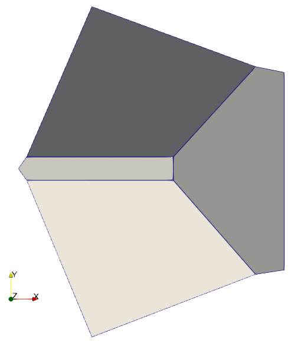
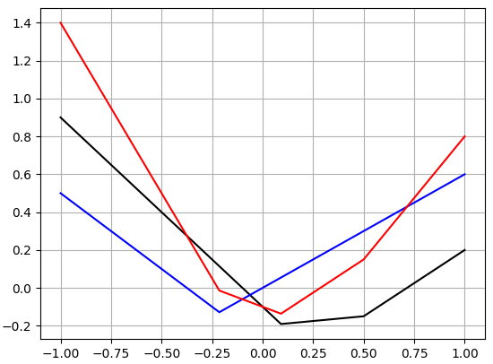

# Python bindings for PolyCon

## Installation

`pip install polycon` should work on the most common platforms.

It includes the precompiled dynamic libraries for the most common cases (e.g. double precision, dimensionality < 10, ...). If your cases are not in the precompiled binary distribution, you will only have to install `cppimport` (`pip install cppimport`) and a C++ compiler (g++ or msvc for instance), the rest will be automatic.

## Construction

`PolyCon` is the name of the main class used to store and handle the polyhedral convex functions.

The main constructor take 4 numpy compatible arrays as input parameters:
* `a_dirs`: a 2D array where `a_dirs[ n, : ]` represents the gradient of `n`th affine function
* `a_offs`: a 1D array where `a_dirs[ n ]` represents the offset of `n`th affine function
* `b_dirs`: a 2D array where `b_dirs[ m, : ]` represents the direction of `m`th boundary (points to the exterior)
* `b_offs`: a 1D array where `b_dirs[ m ]` represents the offset of `m`th boundary (the scalar product of a point on the boundary with the corresponding direction must be equal to this offset).

For instance

```python
from polycon import PolyCon

# affine functions
a_dirs = [ [ -0.8 ], [ +0.1 ], [ +0.6 ] ]
a_offs = [ 0, 0, 1 ]

# boundaries (none for now)
b_dirs = []
b_offs = []

# plot
pd = PolyCon( a_dirs, a_offs, b_dirs, b_offs )
pd.plot()
```

gives something like:


The dots in the matplotlib lines represent infinite edges (i.e. the function is not bounded in this direction).

For illustration, here we add a boundary :

```python
from polycon import PolyCon

# affine functions
a_dirs = [ [ -0.8 ], [ +0.1 ], [ +0.6 ] ]
a_offs = [ 0, 0, 1 ]

# boundaries (we cut x > 3 points)
b_dirs = [ [ 1 ] ]
b_offs = [ 3 ]

# plot
pd = PolyCon( a_dirs, a_offs, b_dirs, b_offs )
pd.plot()
```

We can see that the right line is not dotted and stops at `x = 3`.


## Displaying

The `plot` function uses matplotlib for simple and immediate representations. Here are the most common parameters
* `show` (`True` by default) to launch matplotlib.pyplot.show() at the end of the procedure
* `color` (`black` by default) to give the color of the curve

Alternatively, for more elaborate renderings, one can use `write_vtk` which generates `.vtk` files, that can be used for instance with Paraview of Mayavi. Here is an example:

```python
from polycon import PolyCon
import numpy as np

# a 2D bounded polyhedral convex function
a_dirs = [ [ 0, 0 ], [ 1, 0 ], [ 0, -1 ], [ 0, +1 ] ]
a_offs = [ -0.1, 0, 0, 0 ]

b_dirs = [ [ np.cos( a ), np.sin( a ) ] for a in np.linspace( 0, 2 * np.pi, 5, endpoint=False )]
b_offs = np.ones( len( b_dirs ) )
          
pc = PolyCon( a_dirs, a_offs, b_dirs, b_offs )
pc.write_vtk( "pc.vtk" )
```

If loaded with paraview, `pc.vtk` gives views like




Vtk files are especially useful when there is a large number of affine functions or boundaries. Here is a simple example with 500 points (generated with `PolyCon.from_function_samples` which makes a `PolyCon` from a function and some sample points).

```python
from polycon import PolyCon
import numpy as np

# a 2D bounded polyhedral convex function
points = np.random.uniform( -1, 1, ( 500, 2 ) )
func = lambda x: np.linalg.norm( x )**2

pc = PolyCon.from_function_samples( func, points )
pc.write_vtk( "pc.vtk" )
```


## Normalization

`PolyCon.normalize`
* remove the unused affine functions (the ones that do not change the actual polyhedral function values)
* remove the unused boundaries (the ones that do not change the actual polyhedral function values)
* normalize the boundary directions
* sort the function and the boundaries in lexical order.

It helps to reduce the number of function, and permits comparisons between several convex polyhedral functions.


## Values

`PolyCon.value` and `PolyCon.value_and_gradient` permits for a given point or set of point to get respectively the value and a tuple with the value and the gradient.


## Common mathematical operations

Common operators (`+`, `*`, `/`, ...) are surdefined, as in the following example:

```python
from matplotlib import pyplot 
from polycon import PolyCon

pc = PolyCon( [ [ -1.0 ], [ +0.1 ], [ +0.7 ] ], [ 0.1, 0.2, 0.5 ], [ [ -1 ], [ +1 ] ], [ 1, 1 ] )
pd = PolyCon( [ [ -0.8 ], [ +0.6 ] ], [ 0.3, 0.0 ], [ [ -1 ], [ +1 ] ], [ 1, 1 ] )

pe = pc + pd

pc.plot( "black", show = False )
pd.plot( "blue", show = False )
pe.plot( "red", show = False )
pyplot.show()
```



## Legendre transformations

Example:

```python
from matplotlib import pyplot 
from polycon import PolyCon

afds = [ [ 1, 0.1 ], [ 0.1, -0.7 ], [ 0, +0.7 ] ]
afos = [ 0, 0.1, 0.2 ]
bnds = [ [ 1, 0 ] ]
bnos = [ 3 ]

pc = PolyCon( afds, afos, bnds, bnos )
pd = pc.legendre_transform()
pe = pd.legendre_transform()

print( "\npc =======================================" )
print( pc.normalized() )
print( "\npd =======================================" )
print( pd.normalized() )
print( "\npe =======================================" )
print( pe.normalized() )
```

Gives:

```
pc =======================================
Affine functions:
  +0.00000  +0.70000  +0.20000
  +0.10000  -0.70000  +0.10000
  +1.00000  +0.10000  +0.00000
Boundaries:
  +1.00000  +0.00000  +3.00000

pd =======================================
Affine functions:
  -0.16418  +0.05970  -0.15821
  +3.00000  -3.50000  +2.65000
  +3.00000  +5.33333  +3.53333
Boundaries:
  -0.99746  -0.07125  -0.04987
  +0.00000  -1.00000  +0.70000
  +0.00000  +1.00000  +0.70000

pe =======================================
Affine functions:
  +0.00000  +0.70000  +0.20000
  +0.10000  -0.70000  +0.10000
  +1.00000  +0.10000  -0.00000
Boundaries:
  +1.00000  +0.00000  +3.00000
```

## Infimal convolution

...

## Differentiation (pythorch, ...)

...


